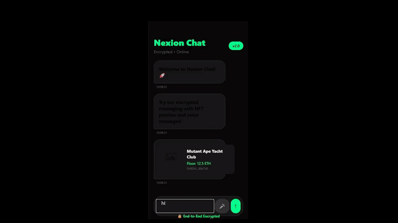

# Nexion Chat SDK 💬

Secure, encrypted chat SDK for React Native applications. Built for Web3 and crypto apps.

## ✨ Features

- 🔒 End-to-end encryption
- 🎨 Customizable themes (light/dark)
- 💬 Voice messages support
- 🖼️ NFT preview in chat
- ⚡ Quick integration (5 minutes)

## 📦 Installation

```bash
npm install nexion-chat-sdk
```

## 🚀 Quick Start

```javascript
const { NexionChat } = require('nexion-chat-sdk');

// Initialize chat
const chat = NexionChat({
  apiKey: 'your-license-key',
  theme: 'dark', // or 'light'
  userId: 'user-123'
});

// Start chatting
chat.init();
```

## 📋 API Reference

### NexionChat(options)
- `apiKey` (required) - Your license key
- `theme` (optional) - 'light' or 'dark'
- `userId` (required) - Unique user identifier

## 💳 Pricing

| Plan | Price | Features |
|------|-------|----------|
| Starter | $99/mo | Basic chat, 1000 users |
| Growth | $299/mo | + Voice messages, NFT preview |
| Enterprise | $999/mo | + White-label, Unlimited users |

## 🔧 Development

```bash
# Clone repository
git clone https://github.com/Nexion1ncs/nexion-chat-sdk.git

# Install dependencies
npm install

# Run tests
npm test
```

## 🎥 Demo



## 📞 Support

- Email: nikkhzijdbdjdn@gmail.com
- Telegram: [@Nik_77891](https://t.me/Nik_77891)
- Issues: [GitHub Issues](https://github.com/Nexion1ncs/nexion-chat-sdk/issues)

## 📄 License

MIT License - see [LICENSE](LICENSE) for details.